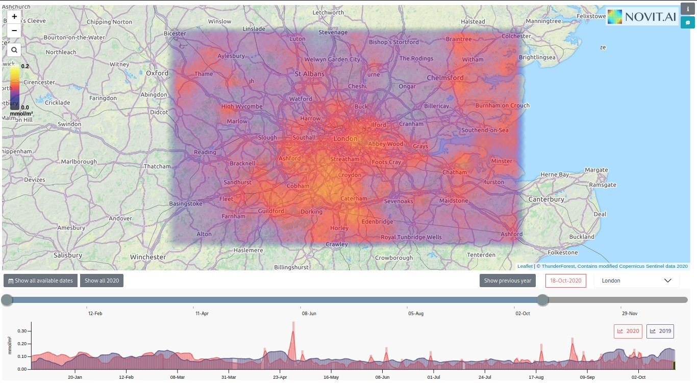

# s5p-client
### Another Sentinel-5 Precursor data query and downloader tool
This tool is written to automate data download, conversion and aggregation for a daily NO2 levels visualisation project.

### Acknowledgements
I wrote this tool while working at Novit.AI for https://emissions.novit.ai project. I'm releasing the source under my management with Novit's permission. 

I would also like to acknowledge and thank the ESA (European Spatial Agency) for the access to the Sentinel 5P Hub.

### Advantages & Disadvantages of this tool
1. Input areas are lat,lon bboxes in the format of minlat, maxlat, minlon, maxlon. While this makes it a breeze to quickly query some areas, if you need to work with more complex geojson defined areas see below.
2. The products are downloaded directly from the copernicus s5phub. This is both an advantage because I've noticed AWS host is sometimes broken and it was missing products, but also a disadvantage because it may not be as fast as the AWS host. In fact, be nice to Copernicus, limit your download bandwidth yourself.
3. If you search for NRT products older than 30 days you'll get nothing. If you search for OFFLINE products newer than 30 days, you'll get nothing. And who knows if there are even any RPRO products. It's just the way s5p data is organised. The tool is not smart enough to tell you if products couldnt be found for a specific reason. It's up to you to send reasonable queries.

### Alternative tool which uses the proper sentinelsat library but a bit more complex
For all purposes that require a bit more official touch; you should probably use below tool
https://github.com/bilelomrani1/s5p-tools

### Installation 
##### Requirements
I'd say you need a Linux, at least a unix-like system. Confirmed working on arch and debian.

##### S5P Client
It's highly suggested to use a virtualenv.
```bash
pip install -r requirements.txt
# Cartopy needs to be installed after numpy is installed because it's build wheel needs it
pip install Cartopy==0.18.0  
python3 s5p.py --help
```
##### Web UI
```
cd reactapp
npm install
npm run build
```

### React App (Web UI) Quick Start:
Assuming you installed the client and built the app as instructed just above:
```bash
cp -Rf sample-s5p-data $HOME/s5p-data
source run_ui.bash
```
Then head to [http://localhost:8080/](http://localhost:8080/).



### S5P Query & Download Tool Usage
s5p.py client comes with a couple of main modes query and download. 
 - Query mode allows downloading of search results with certain flags. 
 - Download mode is just used to download products with their uuids and not very useful on its own. 
 - Populate mode is an extension of query mode for a range of dates.
The 3 most important command you'll most likely need are given in Quick Start.

#### Quick start:
*Query only:*
```bash
python s5p.py query -c milan -pt NO2 -pm NRT
```
*Query and download latest product and convert the netcdf file to geojson and json:*
```bash
python s5p.py query -c milan -pt NO2 -pm NRT -rl 1 -d -g -j -tf /tmp/s5p-data/
```
*Do the above for a range of dates for a set of cities:*
```bash
python s5p.py populate -df 2020-11-01 -dt 2020-11-05 -pt NO2 -c milan -c barcelona -c paris -g -j -d
```

##### Query Mode
Chances are this is the mode you'll use most to both query and automatically download products and convert those products into more friendly jsons. Download flag picks the first product on the results from query for downloading.

You can use arbitrary latlon bboxes but you can also use predefined cities. Cities are defined in a *s5p_cities.py*. If there's an area you'll likely query a lot, I suggest you fork the repo and add in your own cities.

Type in `python3 s5p.py query -h ` to get all available options.

##### Populate Mode
Populate mode is an automated version of download mode for a given range of dates. It's practically an extension to query mode's download flag to query and download the first pick on a range of searches.

Type in `python3 s5p.py populate -h ` to get all available options.

### S5P Summary Generator
S5P data is usually has missing spots or not very reliable on a single measurement. `s5p_summary_generator.py` will take in json files and average them out in the span of a given number of days. And it will even generate summaries for each city too. 

For it to work your data must be structured in accordance to `output_directory_structure.txt` *(more on this later)*.

Type in `python3 s5p_summary_generator.py -h ` to get all available options.

### Automation
All this downloading, averaging and summarisation is a lot of automatisable work. A bash script is provided to be called from cron unsurprisingly called `cron_script.bash`. Of course you may need to dig in and change a few parameters like product type, target folders, the path to python executable etc.

The script is also quite useful on its own too and can be called with a date parameter. You can use this script to use much less parameters to download data for a predefined city by only giving it a date parameter in the form of YYYY-MM-DD.
```bash
./cron_script.bash 2020-11-01
```
1. This will create an `s5p-data` folder in `/tmp` directory and structure it in accordance with `required_download_structure.txt`. 
1. Then it will call `s5p_summary_generator.py` on this folder to generate ready-to-serve jsons in acoordance with `output_directory_structure.txt` in the caller's home directory under `s5p-data` folder.
1. This will then be ready to be served with the reactapp provided as below.
```bash
source run_ui.bash  # sourced so that we can then fg to kill spawned processes
```
This starts two http servers; one `http-server` instance which requires npm. 
The other is a simple python web server defined in `web_app.py`. This script is merely a demo and there are definitely better ways to serve both the data and the react app.

Webapp is served on [http://localhost:8080](http://localhost:8080) .
Json Data is served on http://localhost:8081 .

### Hosting your own version:
```bash
mkdir -p "$HOME/s5p-data/data"
mkdir -p "/tmp/s5p-data/data"
python3 s5p.py populate -df 2020-11-01 -dt $(date +%Y-%m-%d) -pt NO2 -j -d
# wait for it to finish; this will take some time
touch -a "$HOME/s5p-data/excluded.txt"
rsync -va --exclude='*.nc' --exclude-from "$HOME/s5p-data/excluded.txt" --info="progress2" /tmp/s5p-data/data $HOME/s5p-data/
python3 s5p_summary_generator.py -tf $HOME/s5p-data/data/
source run_ui.bash
```

### Excluding bad data
Sometimes there'll be outlier data that just doesn't seem right (i.e. saturated to a level that even a 10-day average shoots up to 100x). 

You may not want to include this in your averaging process. Best way to do that is to simply remove the data associated with that data and call `s5p_summary_generator.py` again. 

But to avoid re-including this data within the automation process is to add a line to `$HOME/s5p-data/excluded.txt` mentioned above so it's not rsynced again from temp folder to data hosting folder. 

Refer to `rsync`'s man pages' `--exclude-from` section ([https://linux.die.net/man/1/rsync](https://linux.die.net/man/1/rsync)).

### Extras 

##### S5P Averager
S5P summary generator uses the algorithms defined in this script to take a running average of the data. This is an implementation file and even though you can run it, it's mostly for test purposes.

Type in `python3 s5p_averager.py -h ` to get all available options.

##### Web_app.py
There is a reason a custom python based web server is used. The webapp can navigate to certain cities by looking at the URL. However, for this to work the backend server needs to not send 404 responses but serve the index.html as usual. 

Try this by typing [http://localhost:8080/paris](http://localhost:8080/paris) or [http://localhost:8080/paris,milan](http://localhost:8080/paris,milan) directly into the browser.

##### Download Mode
Download mode only accepts a product uuid and not very useful on its own. It downloads products in netcdf format with uuid. It cannot tell where and when it really belongs to because it doesn't dive into the downloaded file. 
At this point this an archaic utility and I guess It's only useful if you want to separate your querying and downloading processes.
Type in `python3 s5p.py download -h ` to get all available options.

### License
License is an MIT License if it's not obvious. TL;DR afaik
 - use as you wish
 - i'm not responsible if something breaks
 - an acknowledgement/reference is kindly asked and would be nice